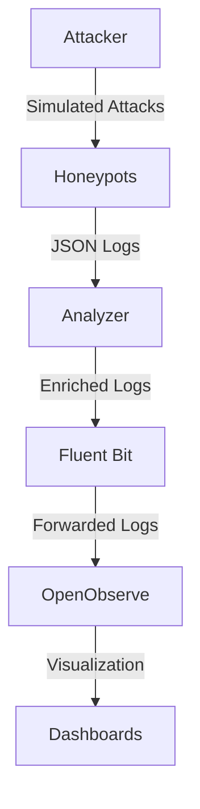

# LaRuche

**LaRuche** is a modular honeypot platform designed for security research, threat intelligence, and educational purposes. It provides SSH, FTP, and HTTP honeypots, along with a comprehensive analysis pipeline and a validation attack toolkit to ensure the honeypots are functioning correctly.

## Features

- **Multi-protocol Honeypots**: SSH, FTP, and HTTP honeypots with realistic decoys and weak credentials.
- **Attacker Module**: A validation toolkit to simulate realistic attacks and verify honeypot functionality.
- **Analysis Pipeline**: Enriches logs with GeoIP, AbuseIPDB, and GreyNoise data, and classifies attacker behavior.
- **Centralized Logging**: Fluent Bit collects and forwards logs to OpenObserve for visualization and analysis.
- **Dashboards**: Pre-configured OpenObserve dashboards for monitoring and threat intelligence.

## Architecture



## Quick Start

### Prerequisites

- Docker and Docker Compose
- Python 3.12+

### Running the Stack

1. Clone the repository:

```bash
git clone https://github.com/qualite863/LaRuche.git
cd LaRuche
```

2. Start the stack:

```bash
docker compose up -d
```

3. Access OpenObserve at `http://localhost:5080` with the default credentials:
   - Username: `admin@laruche.local`
   - Password: `Honeypot2026!`

### Running the Attacker

The `attacker` module is used to validate the honeypots by simulating attacks. It can be run directly or via Docker Compose:

```bash
# Check dependencies
docker compose run --rm attacker check --for all

# Run SSH attack
docker compose run --rm attacker ssh --target 10.13.0.10

# Run FTP attack
docker compose run --rm attacker ftp --target 10.13.0.10

# Run HTTP attack
docker compose run --rm attacker http --target target.example.com

# Run all attacks (nmap discovery, then attack every detected service)
docker compose run --rm attacker all --target 10.13.0.10 --parallel
```

## Components

### Honeypots

- **SSH Honeypot**: Listens on ports 22 and 2222, accepts weak credentials, and logs all interactions.
- **FTP Honeypot**: Listens on ports 21 and 2121, supports anonymous login, and logs all interactions.
- **HTTP Honeypot**: Listens on ports 80 and 8080, emulates a WordPress site, and logs all requests.

## Attacker

`attacker` is the offensive brick (M1SPRO **B10**): it points realistic attacks
at the honeypots to verify they accept the right credentials, serve the right
decoys, and that the whole detection/logging chain actually records the
activity. It is a **validation tool, not a weapon** — it is non-destructive, and
every campaign also flags when the target *looks like a honeypot*.

Available commands: `check` (dependency pre-flight), `ssh`, `ftp`, `http`, and
`all` (nmap discovery, then attack every detected service).

> Wordlists (SecLists default credentials, passwords, usernames, directories)
> are **downloaded automatically** by the script on first use, then cached in
> `attacker/wordlists/`. No manual download is required.

Detailed documentation: [`attacker/README.md`](attacker/README.md).

### Running the attacker

Point `--target` at the host you want to attack — an IP or a hostname:

```bash
docker compose run --rm attacker ssh  --target 10.13.0.10
docker compose run --rm attacker ftp  --target 10.13.0.10
docker compose run --rm attacker http --target target.example.com

# nmap discovery, then attack every detected service (in parallel)
docker compose run --rm attacker all  --target 10.13.0.10 --parallel

# Check dependencies (binaries, payloads, connectivity)
docker compose run --rm attacker check --for all
```

By default the SSH/FTP brute-force tries the service's default credentials
first; add `--full-wordlist` to go straight to the large wordlist. See
[`attacker/README.md`](attacker/README.md) for all options.


### Analyzer

The `analyzer` module enriches logs with additional context:

- **GeoIP**: Adds country, city, and ASN information using MaxMind GeoLite2 databases.
- **AbuseIPDB**: Adds abuse scores for IP addresses.
- **GreyNoise**: Classifies IPs as malicious, benign, or unknown.
- **Behavioral Profiling**: Classifies attackers as bots, bruteforcers, humans, or scanners.

### Fluent Bit

Fluent Bit collects logs from the honeypots and forwards them to OpenObserve. It is configured to:

- Read JSON logs from a shared volume.
- Parse and forward logs to OpenObserve.
- Provide health and metrics endpoints.

### OpenObserve

OpenObserve is used for log storage, visualization, and threat intelligence. It includes:

- **Dashboards**: Pre-configured dashboards for monitoring SSH, FTP, HTTP, and global traffic.
- **Geo & Threat Intel**: Maps IP addresses and provides threat intelligence data.

For detailed documentation, see [`docs/OPEN-OBSERVE.md`](docs/OPEN-OBSERVE.md).

## Configuration

### Environment Variables

The stack can be configured using environment variables:

- `OPENOBSERVE_USER`: OpenObserve username (default: `admin@laruche.local`).
- `OPENOBSERVE_PASSWORD`: OpenObserve password (default: `Honeypot2026!`).
- `ABUSEIPDB_API_KEY`: AbuseIPDB API key (optional).
- `GREYNOISE_API_KEY`: GreyNoise API key (optional).

### GeoIP Databases

To enable GeoIP enrichment, download the MaxMind GeoLite2 databases and place them in `data/geoip/`:

- `GeoLite2-City.mmdb`
- `GeoLite2-ASN.mmdb`

You can download these databases from the [P3TERX/GeoLite.mmdb](https://github.com/P3TERX/GeoLite.mmdb) repository, which provides up-to-date versions of the GeoLite2 databases.

## Documentation

- **[Attacker Documentation](docs/ATTACKER.md)**: Detailed documentation for the attacker module, including how it works, requirements, commands, and usage examples.
- **[OpenObserve Documentation](docs/OPEN-OBSERVE.md)**: Detailed documentation for OpenObserve dashboards, including import instructions, dashboard descriptions, and configuration.
- **[Event Schema](docs/event.schema.json)**: JSON schema for honeypot events, defining the structure and properties of the events generated by the honeypots.

## Acknowledgements

- **SecLists**: For providing wordlists used in the attacker module.
- **MaxMind**: For providing GeoLite2 databases for GeoIP enrichment.
- **OpenObserve**: For providing a powerful log storage and visualization platform.

## Disclaimer

This project is designed for educational and research purposes only. Do not use it to attack systems without explicit permission.
