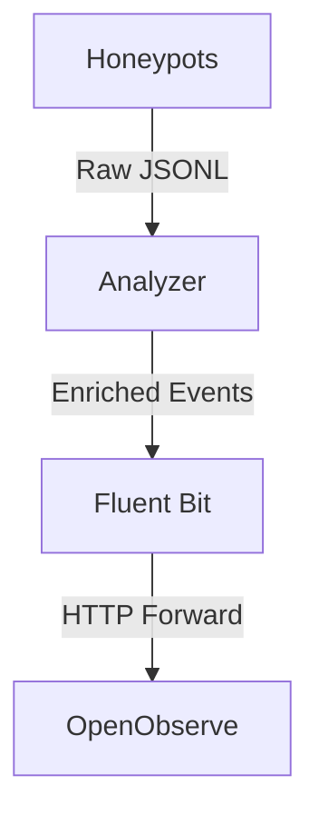

# Fluent Bit — Log Centralization (US-17)

Fluent Bit is the log collector for the LaRuche stack. It centralizes the **enriched events** produced by the analyzer and forwards them to OpenObserve (US-19).

## Pipeline



Fluent Bit **does not read the raw logs** from the honeypots. It only consumes events already enriched by the analyzer (`/var/log/honeypot/enriched/*.jsonl`), which contain the `enrichment` block (geolocation, reputation) and `classification.profile` (behavioral profile).

## Configuration

### Files

- `fluent-bit/fluent-bit.conf`: Main configuration (inputs, filters, outputs).
- `fluent-bit/parsers.conf`: JSON parser for honeypot events.

### Environment Variables

| Variable | Default | Description |
|----------|---------|-------------|
| `OPENOBSERVE_USER` | `admin@laruche.local` | OpenObserve username for authentication. |
| `OPENOBSERVE_PASSWORD` | `Honeypot2026!` | OpenObserve password for authentication. |

## Input

Fluent Bit tails the enriched events produced by the analyzer:

- **Path**: `/var/log/honeypot/enriched/*.jsonl`
- **Parser**: `honeypot_json` (defined in `parsers.conf`)
- **Tag**: `honeypot.*`
- **Read from Head**: Yes (reads existing logs on startup)
- **Refresh Interval**: 5 seconds
- **State Database**: `/var/lib/fluent-bit/state/tail.db` (tracks offsets to avoid re-emitting logs after restart)

## Parser

The `honeypot_json` parser is configured to parse JSON events conforming to the schema defined in `docs/event.schema.json`:

- **Format**: JSON
- **Time Key**: `timestamp` (ISO 8601 UTC with milliseconds, e.g., `2026-06-09T12:59:31.155Z`)
- **Time Format**: `%Y-%m-%dT%H:%M:%S.%LZ`
- **Time Keep**: On (preserves the original timestamp field)

## Filter

A `record_modifier` filter adds a `collected_by` field to each event to track the origin without altering the event data:

- **Match**: `honeypot.*`
- **Record**: `collected_by fluent-bit`

## Outputs

### Stdout

A local debug output for logging Fluent Bit's activity:

- **Format**: `json_lines`
- **Match**: `honeypot.*`

### OpenObserve

The primary output forwards events to OpenObserve via HTTP:

- **Host**: `openobserve`
- **Port**: `5080`
- **URI**: `/api/default/honeypot-events/_json`
- **Format**: `json`
- **Authentication**: Basic Auth using `OPENOBSERVE_USER` and `OPENOBSERVE_PASSWORD`
- **TLS**: Off (for local development)

## Running

Fluent Bit is started as part of the Docker Compose stack:

```bash
docker compose up -d fluent-bit
```

## Health & Metrics

Fluent Bit exposes a health and metrics endpoint on port `2020`:

- **Endpoint**: `http://localhost:2020`
- **Metrics**: Available at `http://localhost:2020/api/v1/metrics`

## Security

- **Non-Root Container**: Fluent Bit runs as a non-root user to minimize the impact of a compromise.
- **No New Privileges**: The container is started with the `no-new-privileges` security option to prevent privilege escalation.
- **Read-Only Volume**: The honeypot logs volume is mounted as read-only to prevent Fluent Bit from modifying the logs.

## License

This project is licensed under the MIT License. See the [LICENSE](LICENSE) file for details.

## Acknowledgements

- **Fluent Bit**: For providing a lightweight and efficient log collector.
- **OpenObserve**: For providing a powerful log storage and visualization platform.

## Disclaimer

This project is designed for educational and research purposes only. Do not use it to attack systems without explicit permission.