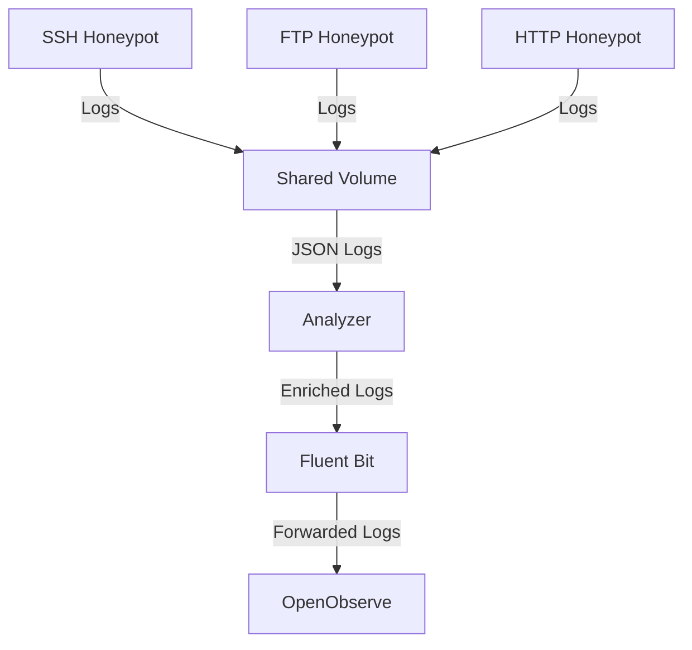

# Honeypots — SSH, FTP, HTTP

LaRuche provides three honeypot services: SSH, FTP, and HTTP. Each honeypot is designed to emulate a real service, accept weak credentials, and log all interactions for analysis.

## Overview

| Honeypot | Ports | Description |
|----------|-------|-------------|
| **SSH** | 22, 2222 | Emulates an SSH server with weak credentials and logs all interactions. |
| **FTP** | 21, 2121 | Emulates an FTP server with anonymous login support and logs all interactions. |
| **HTTP** | 80, 8080 | Emulates a WordPress site and logs all requests. |

## Architecture



## SSH Honeypot

### Configuration

The SSH honeypot is configured using environment variables:

| Variable | Default | Description |
|----------|---------|-------------|
| `SSH_BIND_HOST` | `0.0.0.0` | Host to bind the SSH server. |
| `SSH_BIND_PORT` | `2222` | Port to bind the SSH server. |
| `SSH_HOSTNAME` | `prod-srv-01` | Hostname to display to clients. |
| `SSH_ALLOWED_CREDENTIALS` | `admin:admin123,admin:P@ssw0rd,ubuntu:ubuntu,user:123456,deploy:deploy2023` | Comma-separated list of allowed credentials. |
| `SSH_TARPIT_SECONDS` | `2.5` | Delay in seconds to tarpit failed login attempts. |
| `SSH_LOG_FILE` | `/var/log/honeypot/ssh.jsonl` | Path to the log file. |

### Features

- **Weak Credentials**: Accepts a list of weak credentials to attract attackers.
- **Tarpit**: Delays failed login attempts to slow down brute-force attacks.
- **Logging**: Logs all interactions in JSON Lines format.

### Running

The SSH honeypot can be started using Docker Compose:

```bash
docker compose up -d honeypot-ssh
```

### Logs

Logs are written to `/var/log/honeypot/ssh.jsonl` in JSON Lines format. Each log entry includes:

- `timestamp`: ISO 8601 timestamp.
- `src_ip`: Source IP address.
- `event_type`: Type of event (e.g., `connection`, `auth_attempt`, `auth_success`, `command`).
- `payload`: Event-specific data (e.g., username, password, command).

## FTP Honeypot

### Configuration

The FTP honeypot is configured using environment variables:

| Variable | Default | Description |
|----------|---------|-------------|
| `FTP_BIND_HOST` | `0.0.0.0` | Host to bind the FTP server. |
| `FTP_BIND_PORT` | `2121` | Port to bind the FTP server. |
| `FTP_HOSTNAME` | `prod-srv-01` | Hostname to display to clients. |
| `FTP_BANNER` | `(vsFTPd 3.0.3)` | Banner to display to clients. |
| `FTP_ALLOWED_CREDENTIALS` | `admin:admin123,ftp:ftp,backup:Backup2024,deploy:deploy2023` | Comma-separated list of allowed credentials. |
| `FTP_SSH_CREDENTIALS` | `admin:admin123,admin:P@ssw0rd,ubuntu:ubuntu,user:123456,deploy:deploy2023` | Comma-separated list of SSH credentials to also accept. |
| `FTP_ANONYMOUS` | `true` | Whether to allow anonymous login. |
| `FTP_DECOY_ROOT` | `/srv/ftp` | Root directory for decoy files. |
| `FTP_PASV_MIN` | `30000` | Minimum port for passive mode. |
| `FTP_PASV_MAX` | `30009` | Maximum port for passive mode. |
| `FTP_LOG_FILE` | `/var/log/honeypot/ftp.jsonl` | Path to the log file. |

### Features

- **Weak Credentials**: Accepts a list of weak credentials to attract attackers.
- **Anonymous Login**: Supports anonymous login to maximize capture of reconnaissance.
- **Decoy Files**: Serves decoy files to attract attackers.
- **Logging**: Logs all interactions in JSON Lines format.

### Running

The FTP honeypot can be started using Docker Compose:

```bash
docker compose up -d honeypot-ftp
```

### Logs

Logs are written to `/var/log/honeypot/ftp.jsonl` in JSON Lines format. Each log entry includes:

- `timestamp`: ISO 8601 timestamp.
- `src_ip`: Source IP address.
- `event_type`: Type of event (e.g., `connection`, `auth_attempt`, `auth_success`, `file_download`, `file_upload`).
- `payload`: Event-specific data (e.g., username, password, filename).

## HTTP Honeypot

### Configuration

The HTTP honeypot is configured using environment variables:

| Variable | Default | Description |
|----------|---------|-------------|
| `HONEYPOT_HOST` | `prod-srv-01` | Hostname to display to clients. |
| `HTTP_LOG_FILE` | `/var/log/honeypot/http.jsonl` | Path to the log file. |
| `WP_ALLOWED_CREDENTIALS` | `admin:admin,admin:admin123,administrator:password123` | Comma-separated list of allowed credentials for the WordPress login page. |

### Features

- **WordPress Emulation**: Emulates a WordPress site to attract attackers.
- **Weak Credentials**: Accepts a list of weak credentials for the WordPress login page.
- **Logging**: Logs all interactions in JSON Lines format.

### Running

The HTTP honeypot can be started using Docker Compose:

```bash
docker compose up -d honeypot-http
```

### Logs

Logs are written to `/var/log/honeypot/http.jsonl` in JSON Lines format. Each log entry includes:

- `timestamp`: ISO 8601 timestamp.
- `src_ip`: Source IP address.
- `event_type`: Type of event (e.g., `request`, `credential_attempt`).
- `payload`: Event-specific data (e.g., method, path, username, password).

## Shared Volume

All honeypots write their logs to a shared volume (`honeypot_logs`) mounted at `/var/log/honeypot`. This volume is also mounted by the `analyzer` service, which reads the logs and enriches them with additional context.

## Log Format

All honeypots write logs in JSON Lines format. Each log entry includes the following fields:

| Field | Type | Description |
|-------|------|-------------|
| `id` | string | UUID v4 generated at event creation. |
| `timestamp` | string | ISO 8601 timestamp. |
| `service` | string | Honeypot service (`ssh`, `ftp`, or `http`). |
| `event_type` | string | Type of event (e.g., `connection`, `auth_attempt`, `auth_success`, `request`). |
| `src_ip` | string | Source IP address. |
| `src_port` | integer | Source port. |
| `session_id` | string | Session ID to group all events from the same connection. |
| `payload` | object | Event-specific data. |

For more details on the log format, see the [Event Schema](event.schema.json).

## Running All Honeypots

To start all honeypots, use Docker Compose:

```bash
docker compose up -d
```

This will start the SSH, FTP, and HTTP honeypots, as well as the `analyzer`, `fluent-bit`, and `openobserve` services.

## Testing

To test the honeypots, you can use the `attacker` module to simulate attacks:

```bash
docker compose run --rm attacker ssh --target honeypot-ssh
docker compose run --rm attacker ftp --target honeypot-ftp
docker compose run --rm attacker http --target honeypot-http
```

## Security

- **Non-Root Containers**: All honeypots run as non-root users to minimize the impact of a compromise.
- **No New Privileges**: Containers are started with the `no-new-privileges` security option to prevent privilege escalation.
- **Restart Policy**: Containers are configured to restart unless explicitly stopped.

## License

This project is licensed under the MIT License. See the [LICENSE](LICENSE) file for details.

## Acknowledgements

- **SecLists**: For providing wordlists used in the attacker module.
- **MaxMind**: For providing GeoLite2 databases for GeoIP enrichment.
- **OpenObserve**: For providing a powerful log storage and visualization platform.

## Disclaimer

This project is designed for educational and research purposes only. Do not use it to attack systems without explicit permission.